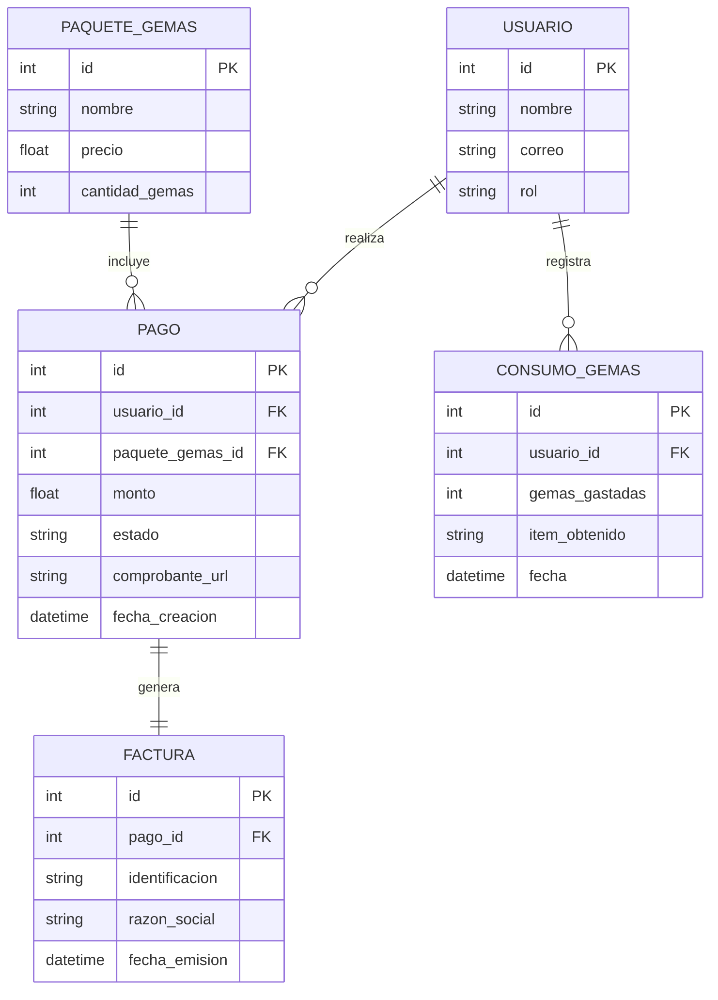
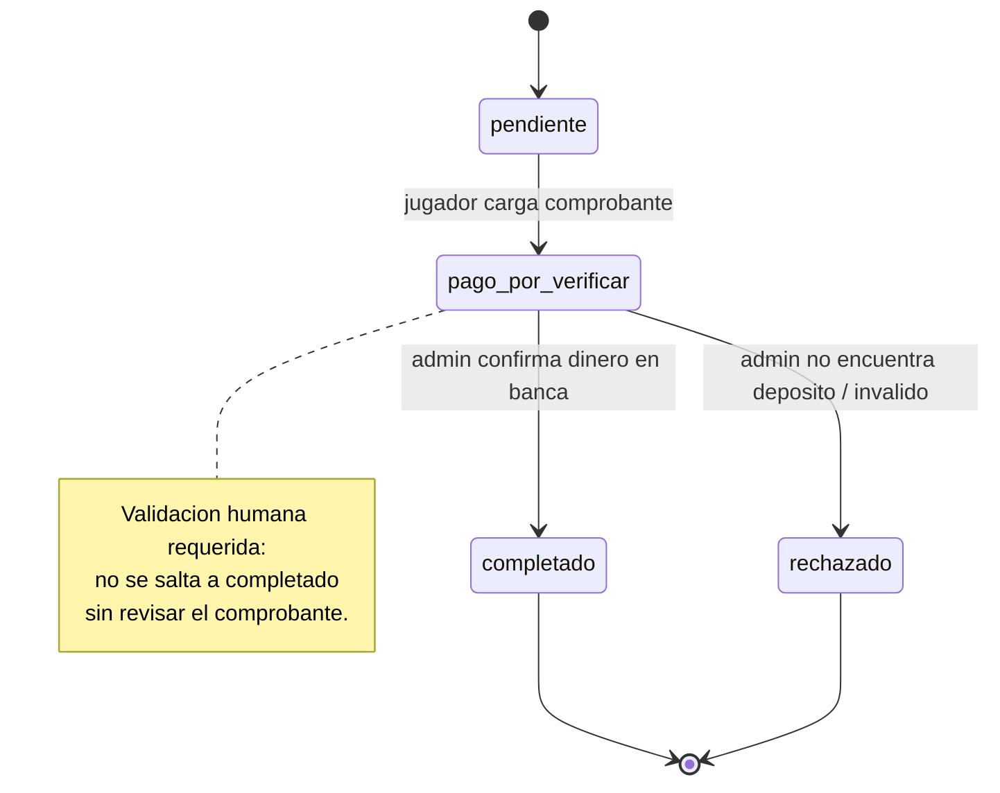

# Hito 1 · Ficha del negocio

**Pareja:** Lago · Macias (Pareja 15)  
**Paralelo:** Aplicaciones Web II A  
**Negocio en una línea:** Aplicación móvil de gestión de tareas y hábitos diarios gamificada estilo RPG retro para personas que buscan organizar su vida y padres que asignan tareas a sus hijos.

---

## 1. Negocio de referencia

Harpagia es una aplicación móvil gamificada en la que los usuarios completan sus tareas y hábitos diarios para hacer evolucionar a su personaje con estética RPG retro. El negocio monetiza mediante la venta de compras dentro de la aplicación (In-App Purchases de $2 a $10 USD), orientadas a desbloquear mejoras visuales, cosméticos exclusivos y acelerar el progreso del avatar para usuarios casuales. Su modelo de cobro se fundamenta en microtransacciones opcionales sin restringir el uso básico de la plataforma. El fundador declara ingresos recurrentes de $13,000 USD mensuales ($150,000 USD al año), respaldados por una comunidad de entre 3,500 y 4,000 usuarios activos mensuales (MAU). Destaca por operar con un presupuesto de $0 USD en publicidad pagada, basando su adquisición de clientes en el crecimiento orgánico y recomendaciones.

**Enlace:** https://youtu.be/axH1e2cZSrw (Starter Story - "This app replaced my 9-5 ($155K/year)")

---

## 2. Caso de contraste

EpicWin es una aplicación de listas de tareas gamificada con temáticas RPG. A diferencia de Harpagia, se lanzó con un modelo de pago obligatorio por descarga ($2.99 USD) en la App Store. A pesar del interés inicial generado por la prensa tecnológica, la aplicación se estancó y perdió relevancia con el tiempo.

**Fuente:** https://techcrunch.com/2010/08/18/epicwin-todo-app/

**Hipótesis:** La diferencia de fondo reside en el modelo de cobro y la barrera de adopción inicial. EpicWin exigía un pago por adelantado antes de que el usuario pudiera validar el valor del producto, restringiendo drásticamente la conversión y el crecimiento viral. En contraste, el modelo freemium de Harpagia y Double Level elimina la fricción de entrada, permite una adopción masiva gratuita y monetiza progresivamente mediante compras opcionales cuando el usuario ya está fidelizado.

---

## 3. Adaptación al Ecuador

1. **Baja bancarización internacional:** En Ecuador, gran parte de los usuarios y padres de familia no disponen de tarjetas de crédito o débito internacionales habilitadas para compras directas en App Store o Google Play.
2. **Acreditación no instantánea por transferencias locales:** Los pagos realizados mediante transferencias bancarias locales (Banco Pichincha, Guayaquil, Deuna) requieren cargar el comprobante y verificar el acreditamiento en la cuenta bancaria del negocio.
3. **Exigencia de facturación electrónica SRI:** La venta de bienes y servicios digitales en Ecuador exige almacenar datos fiscales del cliente (Cédula/RUC, razón social, correo) para la emisión automática de facturas electrónicas autorizadas bajo el régimen RIMPE.

**Qué cambió en el modelo por estas restricciones:**  
Se incorporó el estado `pago_por_verificar` en el flujo de la entidad `Pago` (`pendiente` → `pago_por_verificar` → `completado` / `rechazado`) y se agregó el atributo `comprobante_url`. Esto impide la asignación automática de gemas hasta que el administrador convalide el ingreso del dinero.

---

## 4. Modelo de datos

### Entidad: Usuario

| Atributo | Tipo | Obligatorio | Ejemplo |
|----------|------|-------------|---------|
| id | número entero | Sí | 1 |
| nombre | texto | Sí | Carlos Vera |
| correo | texto | Sí | carlos.vera@example.com |
| rol | uno de: jugador, admin | Sí | jugador |

### Entidad: PaqueteGemas

| Atributo | Tipo | Obligatorio | Ejemplo |
|----------|------|-------------|---------|
| id | número entero | Sí | 10 |
| nombre | texto | Sí | Cofre de 500 Gemas |
| precio | número decimal | Sí | 4.99 |
| cantidad_gemas | número entero | Sí | 500 |

### Entidad: Pago

| Atributo | Tipo | Obligatorio | Ejemplo |
|----------|------|-------------|---------|
| id | número entero | Sí | 101 |
| usuario_id | referencia a otra entidad | Sí | 1 |
| paquete_gemas_id | referencia a otra entidad | Sí | 10 |
| monto | número decimal | Sí | 4.99 |
| estado | uno de: pendiente, pago_por_verificar, completado, rechazado | Sí | pago_por_verificar |
| comprobante_url | texto | No | https://storage.local/comprobantes/deposito_101.png |
| fecha_creacion | fecha y hora | Sí | 2026-10-01T10:00:00Z |

### Entidad: Factura

| Atributo | Tipo | Obligatorio | Ejemplo |
|----------|------|-------------|---------|
| id | número entero | Sí | 5001 |
| pago_id | referencia a otra entidad | Sí | 101 |
| identificacion | texto | Sí | 1314151617 |
| razon_social | texto | Sí | Carlos Vera |
| fecha_emision | fecha y hora | Sí | 2026-10-01T10:05:00Z |

### Entidad: ConsumoGemas

| Atributo | Tipo | Obligatorio | Ejemplo |
|----------|------|-------------|---------|
| id | número entero | Sí | 2001 |
| usuario_id | referencia a otra entidad | Sí | 1 |
| gemas_gastadas | número entero | Sí | 100 |
| item_obtenido | texto | Sí | Espada de Dragón Retro |
| fecha | fecha y hora | Sí | 2026-10-01T11:00:00Z |

### Relaciones

| Entidades | Cardinalidad | Frase |
|-----------|--------------|-------|
| Usuario — Pago | 1—N | Un usuario realiza múltiples pagos de paquetes. |
| PaqueteGemas — Pago | 1—N | Un paquete de gemas puede estar incluido en múltiples pagos. |
| Pago — Factura | 1—1 | Un pago completado genera exactamente una factura electrónica. |
| Usuario — ConsumoGemas | 1—N | Un usuario registra múltiples consumos de gemas en el juego. |

### Structs en Go

```go
package modelos

import "time"

type Usuario struct {
	ID     uint   `gorm:"primaryKey" json:"id"`
	Nombre string `gorm:"type:varchar(100);not null" json:"nombre"`
	Correo string `gorm:"type:varchar(150);uniqueIndex;not null" json:"correo"`
	Rol    string `gorm:"type:varchar(20);not null;default:'jugador'" json:"rol"` // jugador | admin
}

type PaqueteGemas struct {
	ID            uint    `gorm:"primaryKey" json:"id"`
	Nombre        string  `gorm:"type:varchar(100);not null" json:"nombre"`
	Precio        float64 `gorm:"type:decimal(10,2);not null" json:"precio"`
	CantidadGemas int     `gorm:"not null" json:"cantidad_gemas"`
}

type Pago struct {
	ID             uint         `gorm:"primaryKey" json:"id"`
	UsuarioID      uint         `gorm:"not null" json:"usuario_id"`
	PaqueteGemasID uint         `gorm:"not null" json:"paquete_gemas_id"`
	Monto          float64      `gorm:"type:decimal(10,2);not null" json:"monto"`
	Estado         string       `gorm:"type:varchar(30);not null;default:'pendiente'" json:"estado"` // pendiente | pago_por_verificar | completado | rechazado
	ComprobanteURL *string      `gorm:"type:text" json:"comprobante_url,omitempty"`
	FechaCreacion  time.Time    `gorm:"not null" json:"fecha_creacion"`
	Usuario        Usuario      `gorm:"foreignKey:UsuarioID" json:"-"`
	PaqueteGemas   PaqueteGemas `gorm:"foreignKey:PaqueteGemasID" json:"-"`
}

type Factura struct {
	ID             uint      `gorm:"primaryKey" json:"id"`
	PagoID         uint      `gorm:"uniqueIndex;not null" json:"pago_id"`
	Identificacion string    `gorm:"type:varchar(20);not null" json:"identificacion"`
	RazonSocial    string    `gorm:"type:varchar(150);not null" json:"razon_social"`
	FechaEmision   time.Time `gorm:"not null" json:"fecha_emision"`
	Pago           Pago      `gorm:"foreignKey:PagoID" json:"-"`
}

type ConsumoGemas struct {
	ID            uint      `gorm:"primaryKey" json:"id"`
	UsuarioID     uint      `gorm:"not null" json:"usuario_id"`
	GemasGastadas int       `gorm:"not null" json:"gemas_gastadas"`
	ItemObtenido  string    `gorm:"type:varchar(100);not null" json:"item_obtenido"`
	Fecha         time.Time `gorm:"not null" json:"fecha"`
	Usuario       Usuario   `gorm:"foreignKey:UsuarioID" json:"-"`
}
```

**Decisión de tipos que tuvimos que pensar:**  
El campo `ComprobanteURL` de la entidad `Pago` se definió como un puntero a cadena (`*string`) para permitir valores nulos en la base de datos y un valor `null` explícito en JSON cuando la transacción recién se registra en estado `pendiente` antes de que el usuario adjunte el archivo comprobante.

### Diagrama del modelo completo



**Decisión discutible del modelo y por qué la tomamos:**  
Separar `Factura` como una entidad independiente con relación 1-1 en lugar de almacenar `identificacion` y `razon_social` directamente en la tabla `Pago`. Esto mantiene la tabla `Pago` optimizada para consultas transaccionales de la app y aísla la lógica de facturación electrónica del SRI.

---

## 5. Máquina de estados

**Entidad con estados:** `Pago`

| Estado | Qué significa |
|--------|---------------|
| `pendiente` (inicial) | El pago fue registrado por el usuario pero aún no se carga el comprobante de transferencia. |
| `pago_por_verificar` | El usuario adjuntó la foto/PDF del comprobante y está pendiente de revisión administrativa. |
| `completado` | El administrador verificó el pago en la banca en línea y las gemas fueron acreditadas al usuario. |
| `rechazado` | La transferencia no fue hallada en la cuenta bancaria o el comprobante es inválido. |

| De | A | Quién la hace | Condición |
|----|---|---------------|-----------|
| `pendiente` | `pago_por_verificar` | jugador | Carga el comprobante de pago de la transferencia bancaria local. |
| `pago_por_verificar` | `completado` | admin | Verifica en la banca en línea que el dinero se acreditó efectivamente. |
| `pago_por_verificar` | `rechazado` | admin | El comprobante es ilegible o la transferencia no fue encontrada. |

**Transición prohibida y por qué:**  
De `pendiente` no se puede pasar directamente a `completado` (sin pasar por `pago_por_verificar`). Se prohíbe para evitar que un usuario obtenga gemas virtuales de forma automática sin que el equipo administrativo valide el ingreso efectivo del saldo bancario.

### Diagrama de estados



---

## 6. Roles y permisos

| Acción | jugador | admin |
|--------|---------|-------|
| Consultar paquetes de gemas (`GET /paquetes`) | sí | sí |
| Registrar intento de pago (`POST /pagos`) | solo los suyos | no |
| Consultar historial de compras (`GET /pagos/mios`) | solo los suyos | no |
| Ver detalle de un pago (`GET /pagos/{id}`) | solo los suyos | sí |
| Cambiar estado del pago (`PATCH /pagos/{id}/estado`) | no | sí |

---

## 7. Mapa de endpoints por rol

| Endpoint | Rol que lo llama | Pantalla que lo consume | Qué devuelve | Qué valida | Código si falla |
|----------|------------------|-------------------------|--------------|------------|-----------------|
| `GET /paquetes` | jugador | Tienda de Gemas | Lista de paquetes de gemas disponibles | Consulta sin filtros | 500 |
| `POST /pagos` | jugador | Registrar Transferencia | Objeto de pago en estado pendiente | `paquete_gemas_id` válido y existente | 422 |
| `GET /pagos/mios` | jugador | Historial de Compras | Lista de pagos realizados por el usuario autenticado | Token JWT / Autenticación activa | 401 |
| `PATCH /pagos/{id}/estado` | admin | Panel de Verificación | Objeto de pago con el estado actualizado | Transición de estado válida y rol admin | 409 |
| `GET /pagos/{id}` | ambos | Detalle del Pago | Información completa del pago y factura | ID de pago existente en BD | 404 |

### Matriz pantalla × endpoint

| Pantalla | `GET /paquetes` | `POST /pagos` | `GET /pagos/mios` | `PATCH /pagos/{id}/estado` | `GET /pagos/{id}` |
|----------|:---------------:|:------------:|:----------------:|:-------------------------:|:-----------------:|
| Tienda de Gemas | X | | | | |
| Registrar Transferencia | | X | | | |
| Historial de Compras | | | X | | X |
| Panel de Verificación | | | | X | X |

**Endpoints que ya están funcionando y en qué archivo:**
- `GET /paquetes` → `internal/doublelevel/manejadores.go`
- `POST /pagos` → `internal/doublelevel/manejadores.go`

---

## 8. Declaración de IA

Se utilizó inteligencia artificial como asistente para estructurar la documentación en formato Markdown, validar la sintaxis de los diagramas Mermaid y dar formato adecuado a las estructuras en Go.