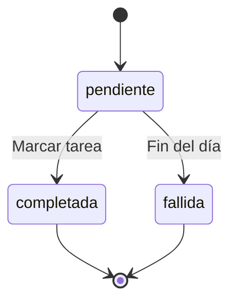

# Ficha del negocio: Double Level

## 1. Negocio de referencia
Double Level es una plataforma que gamifica la productividad convirtiendo la vida real en un juego de rol. Vende motivación y organización a estudiantes y profesionales. Según Starter Story, este nicho genera alta retención porque la penalización visual (perder salud del avatar) apela a la aversión a la pérdida.
Fuente: [Habitica en Indie Hackers / Starter Story](https://www.indiehackers.com/)

## 2. Caso de contraste
Un caso de contraste son las aplicaciones tradicionales de seguimiento de hábitos. Aunque funcionales, estas apps sufren de altas tasas de abandono a las pocas semanas. 
**Hipótesis:** El fracaso en la retención a largo plazo se debe a la falta de supervisión social y recompensa emocional inmediata. Una lista de tareas vacía no genera el mismo impacto psicológico que ver a tu avatar "desmayarse" o perder una racha que afecta la partida de tu compañero de equipo.

## 3. Adaptación al Ecuador
1. **Monetización y Pagos:** Habitica cobra suscripciones en dólares con tarjetas de crédito. Al ser el nuestro un proyecto universitario en fase inicial para estudiantes, no implementaremos pasarelas de pago reales ni cobraremos. 
   * *Efecto:* La economía del juego será 100% basada en el mérito; el "oro" virtual solo se ganará completando misiones reales, sin opción de comprarlo con dinero.
2. **Recompensas Tangibles Locales:** Las recompensas genéricas de las apps extranjeras no conectan con el usuario local.
   * *Efecto:* Implementaremos un sistema de "Cupones Reales" personalizables para canjear el oro virtual por actividades de pareja o amigos en Manta (ej. "Ir por unas alitas" o "Pagar el cine"). 
3. **Cambio en el modelo por la restricción 1:** Al no manejar transacciones con dinero real ni facturación, **el modelo de datos descarta cualquier entidad de pagos y roles de Administrador financiero**. El sistema se sostiene exclusivamente con dos roles (`Propietario` y `Compañero`) interactuando sobre el estado de la entidad `Misión`.

## 4. Modelo de datos

### Entidades

**Usuario**
| Atributo | Tipo | Obligatorio | Ejemplo |
| :--- | :--- | :--- | :--- |
| id | número entero | sí | 1 |
| nombre | texto | sí | Gia |
| clase | uno de: paladin, aprendiz, explorador | sí | aprendiz |
| nivel | número entero | sí | 5 |

**Misión**
| Atributo | Tipo | Obligatorio | Ejemplo |
| :--- | :--- | :--- | :--- |
| id | número entero | sí | 1042 |
| titulo | texto | sí | Estudiar Go |
| dificultad | uno de: facil, media, dificil | sí | media |
| estado | uno de: pendiente, completada, fallida | sí | pendiente |
| usuario_id | referencia a Usuario | sí | 1 |

### Relaciones
* Un Usuario tiene muchas Misiones (1 a N).
* Cada Misión pertenece a un solo Usuario.

### Structs en Go
```go
package misiones

import "gorm.io/gorm"

type Usuario struct {
	gorm.Model
	Nombre   string   `json:"nombre"`
	Clase    string   `json:"clase"`
	Nivel    int      `json:"nivel"`
	Misiones []Mision `json:"misiones"` 
}

type Mision struct {
	gorm.Model
	Titulo     string `json:"titulo"`
	Dificultad string `json:"dificultad"`
	Estado     string `json:"estado"`
	UsuarioID  uint   `json:"usuario_id"` 
}

Diagrama del Modelo (Mermaid)
erDiagram
    USUARIO ||--o{ MISION : "tiene"
    USUARIO {
        int id PK
        string nombre
        string clase
        int nivel
    }
    MISION {
        int id PK
        string titulo
        string dificultad
        string estado
        int usuario_id FK
    }
}

## 5. Máquina de estados

### Tabla de estados de Misión
| Estado | Significado en el negocio |
| :--- | :--- |
| **pendiente** (Inicial) | La tarea del día ha sido creada pero aún no se ha marcado. |
| **completada** | El usuario marcó la tarea y el avatar recibió el XP/Oro. |
| **fallida** | Terminó el día y la tarea no se realizó, el usuario recibe daño. |

### Tabla de transiciones
| De | A | Quién la hace | Condición |
| :--- | :--- | :--- | :--- |
| pendiente | completada | usuario_propietario | El usuario hace check en la app. |
| pendiente | fallida | sistema | Llega la medianoche y sigue en pendiente. |

### Diagrama de Estados (Mermaid)


**Transición prohibida:** De `completada` NO se puede volver a `pendiente` ni a `fallida`. 
*Razón:* Si un usuario se equivoca al marcar una tarea, no puede simplemente desmarcarla porque la experiencia, el oro y el daño al "Jefe Semanal" ya se sincronizaron en tiempo real con su compañero. Permitirlo falsearía el avance cooperativo.

## 6. Roles y permisos

| Acción | Propietario (Dúo A) | Compañero (Dúo B) |
| :--- | :--- | :--- |
| Crear misiones | Sí (solo suyas) | No |
| Ver misiones | Sí (solo suyas) | Sí (las del dúo) |
| Actualizar estado de misión | Sí (solo suyas) | No |
| Borrar misiones | Sí (solo suyas) | No |

## 7. Mapa de endpoints por rol

| Endpoint | Rol | Pantalla que lo consume | OK | Error |
| :--- | :--- | :--- | :--- | :--- |
| `POST /misiones` | Propietario | Nueva Tarea | 201 | 422 (título vacío) |
| `GET /misiones` | Ambos | Tablero Principal / Campamento | 200 | 500 |
| `GET /misiones/{id}` | Ambos | Detalle de la misión | 200 | 404 |
| `PATCH /misiones/{id}/estado`| Propietario | Tablero Principal | 200 | 422 |

### Matriz Pantalla x Endpoint
| Pantalla | `POST /misiones` | `GET /misiones` | `PATCH /misiones/{id}/estado` | `GET /misiones/{id}` |
| :--- | :--- | :--- | :--- | :--- |
| Nueva Tarea | ✓ | | | |
| Tablero Principal / Campamento | | ✓ | ✓ | |
| Detalle de misión | | | | ✓ |

Los endpoints de creación, listado y visualización ya están funcionando en `internal/misiones/manejadores.go`.

## 8. Declaración de IA
- Se utilizó Gemini AI (Google) para estructurar el formato Markdown, generar los diagramas Mermaid compatibles con GitHub y validar la lógica técnica de la máquina de estados frente a la rúbrica del Hito 1.